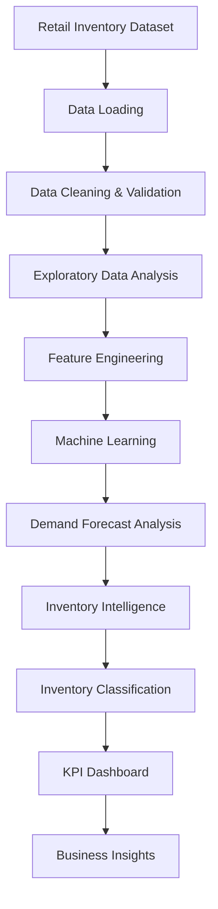
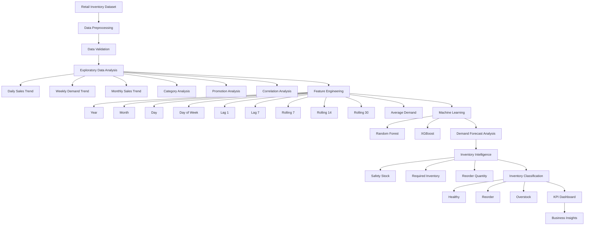

# 📦 FORESIGHT – AI-Powered Demand & Inventory Intelligence

## 📌 Overview

This project presents an AI-powered demand and inventory intelligence platform designed to analyze historical retail data, understand demand patterns, evaluate inventory health, and generate data-driven reorder recommendations.

FORESIGHT combines exploratory data analysis, time-series feature engineering, machine learning experimentation, demand forecast analysis, and inventory intelligence to help businesses reduce overstocking, identify potential stock shortages, and make data-driven inventory decisions.

The system analyzes 68,700 processed retail inventory records and provides product-level inventory classification, reorder recommendations, demand insights, and KPI-based visualization.

---

## ⭐ Highlights

* AI-powered demand and inventory intelligence platform.
* Analysis of 68,700 processed retail inventory records.
* Historical daily, weekly, and monthly demand analysis.
* Time-series feature engineering using lag and rolling features.
* Comparative experimentation using Random Forest and XGBoost.
* Demand prediction evaluation using MAE, RMSE, and R².
* Forecast-based inventory requirement analysis.
* Automated reorder quantity calculation.
* Inventory classification into Healthy, Reorder, and Overstock.
* Identification of top products requiring replenishment.
* KPI-based inventory intelligence dashboard.
* Designed for future deployment in retail and supply chain applications.

---

## 🎯 Objectives

* Analyze historical retail sales and inventory data.
* Identify daily, weekly, and monthly demand patterns.
* Understand the relationship between inventory levels and units sold.
* Analyze the impact of pricing, discounts, promotions, weather, and seasonality.
* Engineer time-series demand features.
* Train and evaluate machine learning regression models.
* Analyze the existing demand forecast provided in the dataset.
* Calculate required inventory levels.
* Generate data-driven reorder recommendations.
* Identify healthy, reorder, and overstock inventory conditions.
* Develop a business-oriented inventory intelligence dashboard.

---

## 🚀 Features

* Historical retail demand analysis.
* Daily, weekly, and monthly sales trend visualization.
* Category-wise sales analysis.
* Inventory vs sales analysis.
* Promotion and discount analysis.
* Correlation analysis.
* Time-series feature engineering.
* Lag-based demand features.
* Rolling demand features.
* Random Forest regression.
* XGBoost regression.
* Demand forecast evaluation.
* Safety stock and required inventory calculation.
* Reorder quantity generation.
* Inventory health classification.
* Top reorder product identification.
* KPI-based inventory dashboard.
* Business-oriented inventory insights.

---

## 🏗️ Methodology Workflow

---

## 🛠️ Technologies Used
* Python
* Pandas
* NumPy
* Matplotlib
* Scikit-learn
* XGBoost
* Jupyter Notebook
* Machine Learning
* Time-Series Analysis
* Data Visualization
---

## 📂 Dataset
Dataset Overview : 

The project uses a retail store inventory dataset containing historical information about stores, products, demand, inventory, pricing, promotions, weather, competitor pricing, and seasonality.
| Feature            | Description                    |
| ------------------ | ------------------------------ |
| Date               | Transaction date               |
| Store ID           | Unique store identifier        |
| Product ID         | Unique product identifier      |
| Category           | Product category               |
| Region             | Store region                   |
| Inventory Level    | Available inventory            |
| Units Sold         | Actual units sold              |
| Units Ordered      | Units ordered                  |
| Demand Forecast    | Existing demand forecast       |
| Price              | Product price                  |
| Discount           | Applied discount               |
| Weather Condition  | Weather condition              |
| Holiday/Promotion  | Promotion or holiday indicator |
| Competitor Pricing | Competitor price               |
| Seasonality        | Seasonal category              |

---

## 🧹 Data Preprocessing

The following preprocessing steps were performed:

* Dataset loading using Pandas.
* Data type inspection.
* Missing-value analysis.
* Duplicate-value analysis.
* Date conversion into datetime format.
* Extraction of Year, Month, Day, and Day of Week.
* Categorical feature encoding.
* Time-series sorting.
* Lag feature generation.
* Rolling-window feature generation.
* Removal of initial NaN values generated by lag and rolling features.

---

## 🔄 Data Flow

---
## 🧠 Feature Engineering

Time-series and demand-related features were created to capture historical demand behavior.

**Temporal Features**
* Year
* Month
* Day
* Day of Week

**Lag Features**
* Lag 1
* Lag 7
* Lag 4 Week

**Rolling Features**
* Rolling 7-day average
* Rolling 14-day average
* Rolling 30-day average
* Rolling 4-week average
Additional Features
* Average Demand
* Inventory Level
* Units Ordered
* Price
* Discount
* Competitor Pricing
* Holiday/Promotion

These features were used to understand historical demand behavior and support machine learning and inventory intelligence.

---

## 🤖 Machine Learning Models
Random Forest Regressor :

Random Forest was used to model the relationship between historical demand-related features and units sold.

**Training Configuration**  :

| Parameter    | Value |
| ------------ | ----- |
| n_estimators | 100   |
| max_depth    | 15    |
| random_state | 42    |
| n_jobs       | -1    |

**Performance**   :

| Metric | Value  |
| ------ | ------ |
| MAE    | ~69.06 |
| RMSE   | ~88.37 |
| R²     | ~0.332 |

**XGBoost Regressor** :

XGBoost was evaluated as a gradient boosting regression model for demand-related prediction.

**Training Configuration**  :

| Parameter        | Value |
| ---------------- | ----- |
| n_estimators     | 500   |
| learning_rate    | 0.05  |
| max_depth        | 6     |
| subsample        | 0.8   |
| colsample_bytree | 0.8   |
| random_state     | 42    |

**Performance**  :

| Metric | Value  |
| ------ | ------ |
| MAE    | ~69.20 |
| RMSE   | ~88.64 |
| R²     | ~0.327 |

---

## 📈 Existing Demand Forecast Evaluation

The dataset contains an existing Demand Forecast variable that was evaluated against actual Units Sold.

**The existing demand forecast achieved**  :
| Metric | Value  |
| ------ | ------ |
| MAE    | ~8.34  |
| RMSE   | ~10.02 |
| R²     | ~0.992 |

This forecast was therefore treated as a strong baseline for the inventory intelligence layer.

---

## 📦 Inventory Intelligence

The inventory intelligence layer uses demand information and current inventory levels to determine the required inventory position and potential replenishment requirements.

**Inventory Status**  :

The system classifies inventory into three categories :

| Status    | Description                                 |
| --------- | ------------------------------------------- |
| Healthy   | Inventory level is sufficient               |
| Reorder   | Additional inventory is recommended         |
| Overstock | Inventory is higher than the required level |

---

## 📊 Results

**Overall Inventory KPI**  :

| Metric                    | Value      |
| ------------------------- | ---------- |
| Total Records             | 68,700     |
| Reorder Items             | 2,437      |
| Healthy Items             | 29,533     |
| Overstock Items           | 36,730     |
| Reorder Rate              | 3.55%      |
| Overstock Rate            | 53.46%     |
| Recommended Reorder Units | 114,352.77 |

---

## 🏆 Key Findings
* 68,700 processed retail inventory records were analyzed.
* 2,437 records were identified as requiring reorder.
* 29,533 records were classified as Healthy.
* 36,730 records were classified as Overstock.
* The overall Reorder Rate was 3.55%.
* The Overstock Rate was 53.46%.
* The system generated approximately 114,353 units of recommended replenishment.
* Inventory Level was identified as the most influential feature in the Random Forest analysis.
* Historical lag and rolling demand features contributed to demand-related prediction.
* Product-level reorder analysis identified the products requiring the highest replenishment quantities.

---

## 📈 Feature Importance

Random Forest feature importance analysis identified several important variables influencing the prediction.

**The top features included**   :

* Inventory Level
* Rolling 30-day demand
* Rolling 7-day demand
* Lag 1
* Lag 7
* Units Ordered
* Price
* Competitor Pricing
* Day
* Month
* Day of Week

These features provide insights into the factors associated with retail demand behavior.

---

##  📊 Inventory Dashboard

The FORESIGHT dashboard provides a consolidated view of demand and inventory intelligence.

**Dashboard Components**  : 
* Total Inventory Records
* Reorder Items
* Healthy Items
* Overstock Items
* Reorder Rate
* Overstock Rate
* Recommended Reorder Units
* Inventory Status Distribution
* Top 10 Products Requiring Reorder
* Actual Sales vs Demand Forecast
* Monthly Sales Trend

---

##  🔍 Top Reorder Products

The analysis identified products with high recommended reorder quantities.

**Some of the top reorder recommendations included**   :

| Product | Category  |
| ------- | --------- |
| P0010   | Toys      |
| P0019   | Clothing  |
| P0009   | Clothing  |
| P0019   | Furniture |
| P0012   | Groceries |
| P0009   | Groceries |
| P0004   | Furniture |
| P0005   | Furniture |
| P0008   | Groceries |
| P0008   | Furniture |

---

##  📊 Evaluation Metrics

The machine learning and forecasting analysis used the following evaluation metrics:

* Mean Absolute Error (MAE)
* Root Mean Squared Error (RMSE)
* R² Score

**MAE**

Measures the average absolute difference between actual and predicted values.

**RMSE**

Measures prediction error while giving higher weight to larger errors.

**R² Score**

Measures how well the model explains the variation in the target variable.

---

##  📸 Model & Data Visualizations

The project includes several visualizations for understanding retail demand and inventory behavior:

* Daily Sales Trend
* Weekly Demand Trend
* Monthly Sales Trend
* Category-wise Total Sales
* Inventory Level vs Units Sold
* Promotion vs No Promotion Analysis
* Correlation Analysis
* Random Forest Feature Importance
* Actual Sales vs Demand Forecast
* Inventory Status Distribution
* Top 10 Products Requiring Reorder

---

##  ⚠️ Challenges Faced

* Highly variable daily sales.
* Significant fluctuations in demand.
* Large variation in inventory levels.
* Time-series feature generation.
* Initial missing values caused by lag and rolling features.
* High proportion of overstock records.
* Independent machine learning models showed moderate predictive performance.
* Retail demand can be affected by multiple external factors.

 ---

 ##  🌍 Applications

 
* Retail Inventory Management
* Demand Planning
* Supply Chain Analytics
* Stock Replenishment
* Warehouse Management
* Inventory Optimization
* Product Demand Analysis
* Business Intelligence
* Retail Decision Support
* AI-powered Supply Chain Solutions

---

##   💻 Hardware and Software Environment

**Hardware**
* Computer system with sufficient RAM for large tabular datasets.
* GPU support can be used for future advanced forecasting models.

**Software**
* Python
* Jupyter Notebook
* Pandas
* NumPy
* Matplotlib
* Scikit-learn
* XGBoost
* GitHub
